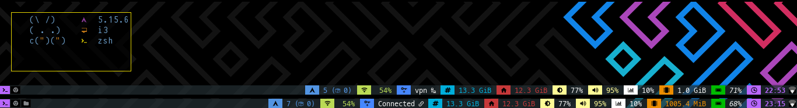

# py3nordStatus for i3

nordvpn for py3status using (external_script)
module

Requirements
> Nordvpn / py3status



>my i3status.conf settings for the script
```
order += "external_script"

external_script {
    format = "<span color'#000' bgcolor='#4687ff' size='large'>  </span> {output}"
    script_path = "~/.config/i3/scripts/nordvpn-status.sh"
    interval = 5
    serparator = false
}
```
